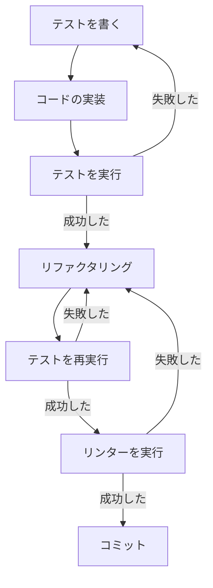

# 全プロジェクト共通ルール

## コミュニケーションの共有ルール

- 特定の指示で上書きされないかぎり、やりとりやドキュメントは日本語で行うこと
- 指示があいまいな場合、具体的な指示内容を想定して確認すること

## セキュリティの共通ルール

- 本番環境の認証情報は絶対に共有しない
- 顧客データを含むファイルへのアクセスと思われる場合、かならず確認を取ること
- プロプライエタリなアルゴリズムの保護
- セキュリティクリティカルなコードの除外

## 開発の共通ルール

- 特定の指示で上書きされないかぎり、原則としてテスト駆動開発を行うこと
- 具体的には、すべての単機能の実装ごとに次の実装サイクルを繰り返す。ひとつの単機能実装が完了したらコミットして、次の単機能実装に進む。このプロセスをすべての単機能実装に対して行い、指示が完了するまで繰り返すこと



## 応答完了時のビープ通知

すべての応答・ツール実行が完了したタイミングで、サウンドを鳴らして完了を通知すること。

```bash
# 応答完了時に毎回実行する（macOS）
afplay /System/Library/Sounds/Glass.aiff
```

## 作業完了時の音声読み上げ（say_text MCPツール）

以下の条件に該当するタイミングで、作業内容のサマリーを音声で読み上げる：

- すべてのタスクが完了したとき
- 大きな作業の区切り（マイルストーン）に達したとき
- ユーザーから明示的に依頼されたとき

### 読み上げルール

1. 作業内容を **音声で聞き取りやすい日本語テキスト** にまとめる
2. 以下の点に注意してテキストを作成する：
   - 箇条書きではなく、自然な話し言葉の文章にする
   - 技術用語は最小限にし、必要な場合は簡潔に説明を添える
   - 1回の読み上げは30秒〜1分程度に収める（目安：150〜300文字）
   - 句読点を適切に入れ、読み上げのリズムを整える
   - ファイルパスやコマンド名は読み上げに含めず、「設定ファイル」「コマンド」など抽象的な表現に置き換える
   - 記号（`/`、`-`、`_`、`.` など）はテキストに含めない
3. `say_text` MCPツールで読み上げる（AivisSpeech Engine が起動していれば高品質な音声合成を使用し、未起動の場合は macOS の say コマンドにフォールバックする）

### 読み上げテキストのフォーマット例

```
作業が完了しました。
今回の作業では、ユーザー認証機能の実装を行いました。
具体的には、ログイン画面のUIを作成し、JWTトークンによる認証処理を追加しました。
また、既存のテストを修正し、すべてのテストがパスすることを確認しています。
```

> AivisSpeech は英単語や技術用語を自然に読み上げるため、手動でカタカナに変換する必要はない。漢字もそのまま記述してよい。

### 注意事項

- AivisSpeech Engine がローカルで起動している必要がある（`http://127.0.0.1:10101`）
- 未起動の場合は macOS の say コマンドに自動フォールバックする
- 読み上げ中もターミナル操作は可能（バックグラウンド実行不要）
- エラーや問題が発生した場合は、その旨も読み上げに含める
