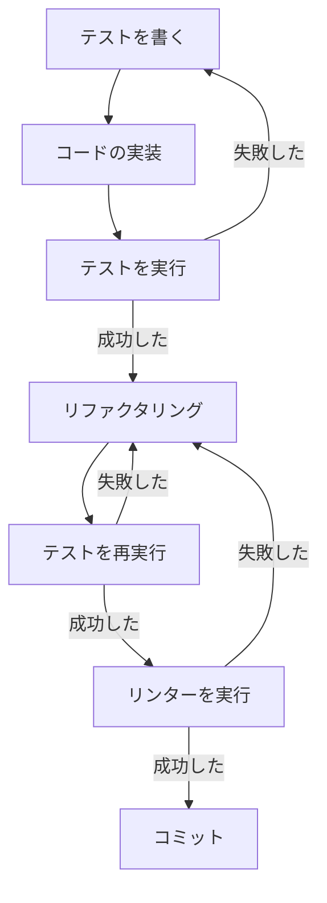

# 全プロジェクト共通ルール

## コミュニケーションの共有ルール

- 特定の指示で上書きされないかぎり、やりとりやドキュメントは日本語で行うこと
- 指示があいまいな場合、具体的な指示内容を想定して確認すること

## セキュリティの共通ルール

- 本番環境の認証情報は絶対に共有しない
- 顧客データを含むファイルへのアクセスと思われる場合、かならず確認を取ること
- プロプライエタリなアルゴリズムの保護
- セキュリティクリティカルなコードの除外

## 開発の共通ルール

- 特定の指示で上書きされないかぎり、原則としてテスト駆動開発を行うこと
- 具体的には、すべての単機能の実装ごとに次の実装サイクルを繰り返す。ひとつの単機能実装が完了したらコミットして、次の単機能実装に進む。このプロセスをすべての単機能実装に対して行い、指示が完了するまで繰り返すこと

